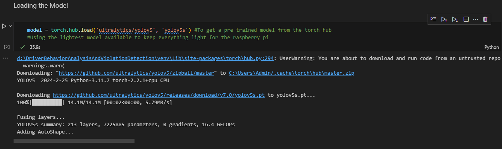

# DriverBehaviorAnalysisAndViolationDetection
Driver Behavior Analysis And Violation Detection


## Project Initialization 

To initialize and set up the code base

1. Ensure Python is downloaded 

```bash
  python --version
```
*Ensure You Have python version 3.11 or above.*

2. Install Virtual Environment

```bash
  pip install virtualenv
```

3. Create a Virtual Environment

```bash
  virtualenv venv
```

4. Activate the Virtual Environment 

```bash
  venv\scripts\activate
```

5. Installing the Required Libraries and Modules

```bash
  pip install -r requirements.txt
```

## Data Set

1. To clean the data 
- *Before cleaning the database change the directory name in the script*
```bash
  python data_pre_processing.py
```

2. To get more data through web scrapping with microsoft edge
```bash
  python web_scraping_image.py
```

## Installing  Pytorch and Yolo V.5 

1. Installing Pytorch

```bash
pip3 install torch torchvision torchaudio
```
2. Cloning Yolo and installing the required libraries

Clone repo and install requirements.txt in a Python>=3.8.0 environment
```bash
git clone https://github.com/ultralytics/yolov5  # clone
cd yolov5
pip install -r requirements.txt  # install
```

## Loading the model 



## Cloning a labeling library
```bash
git clone https://github.com/HumanSignal/labelImg.git
```
